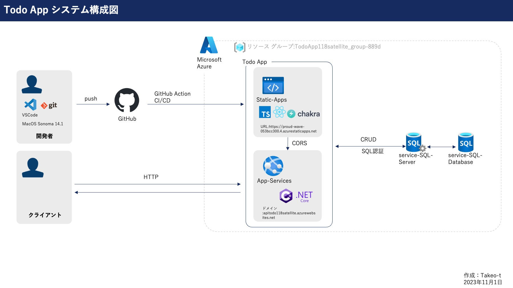
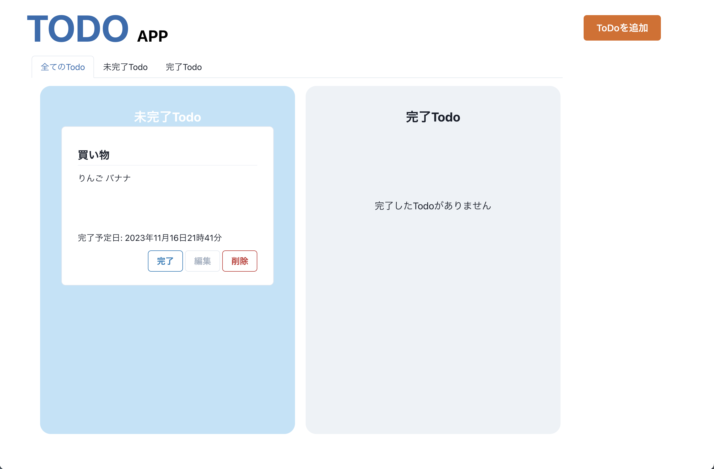
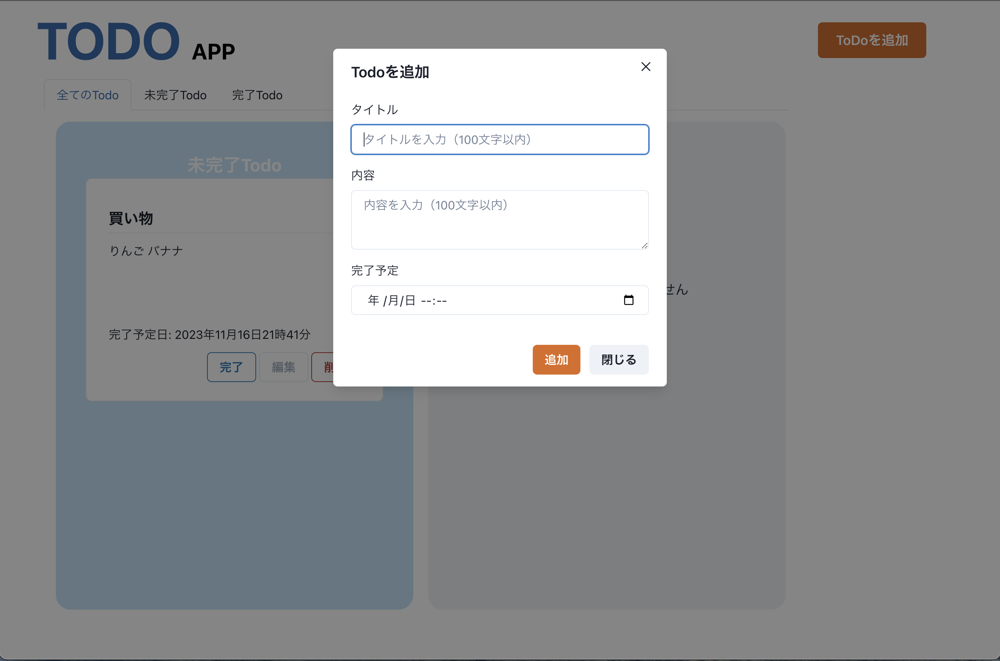
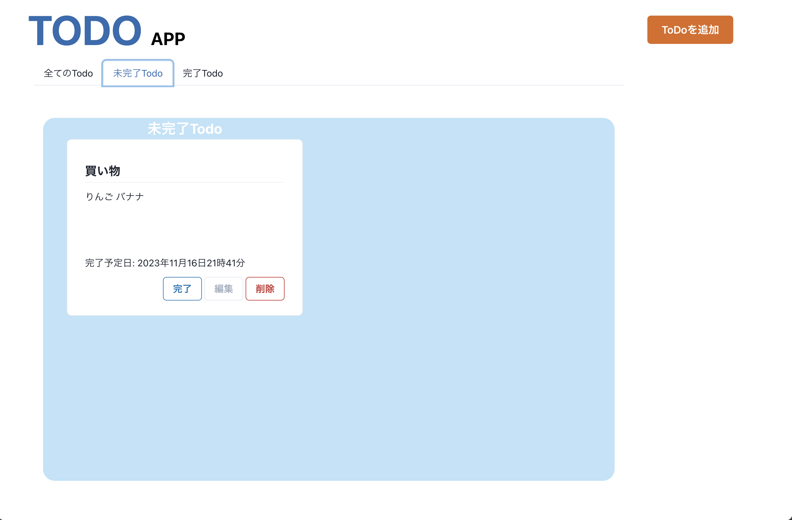
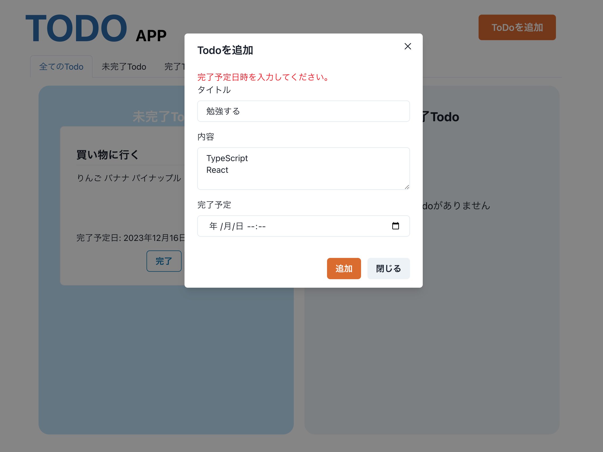
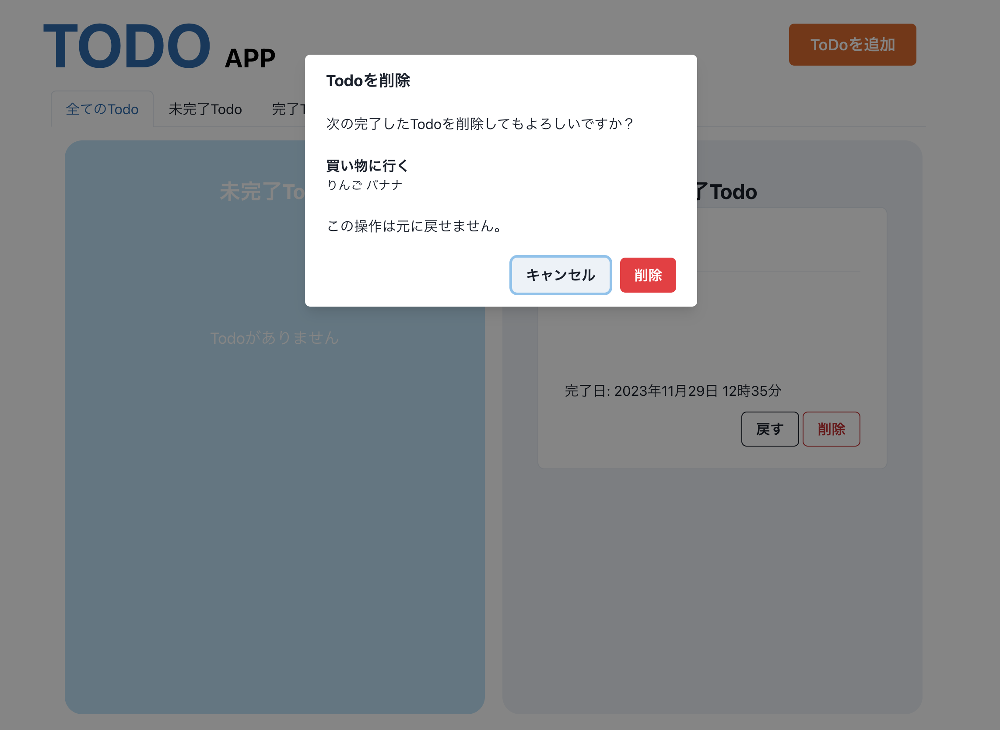

# 1.プロジェクト名：TODO APP
本プロジェクトはタスク管理アプリケーション（Todoアプリ）の一部を構成するものです。
# 2.概要  
## 2-1. システム構成について  
本アプリケーションはTodoアプリケーションのフロントエンド部分を担当します。  
システム構成を下記に示します。
  
## 2-2. 技術選定について
本アプリケーションはReactで記述しており、さらに静的型付け言語のTypeScriptを導入しています。  
変数やコンポーネントが受け付ける値の型を定義できるため意図しない値が設定されることによるバグを未然に防げたり、エディタのコード補完による開発者体験が向上することが期待できます。  

# 3.画面構成
  
##### Todoを追加ボタンを押下することでTodo追加のモーダルが展開します。  
  
##### タブを選択することで全Todo,未完了Todo,完了Todoと表示を切り替えます。例として未完了Todoの表示状態を示します。  

##### タイトルと内容には入力文字数100文字以内の制限を設定しています。  

##### Todoの内容に未入力事項がある場合、もしくは入力文字数が100文字を超えた場合はユーザーに警告を表示します。
  
##### Todoの完了ボタンを押すことで完了TodoコーナーへTodoが移動します。戻すボタンを押すと未完了Todoコーナーへ戻すことができます。  
  
##### Todoを削除する場合は確認画面が表示されます。  


# 4.依存関係
プロジェクトの依存関係は`package.json`を参照してください。  

# 5.セットアップ手順
npmのインストールを前提とします。
```
npm install
```
```
git clone https://github.com/takeo-t/TodoApp.git //ローカルにセットアップ
cd todo_app
```
```
npm start //ローカルサーバーの立上げ
```
```
npm run build //プロジェクトをビルドする。 
```

# 6. アプリケーションのホスト先
 Microsoft Azure Static Web Appsにホストしています。  
 [リンクはこちら](https://proud-wave-053bcc300.4.azurestaticapps.net "TodoApp")  
 ※サーバーの立ち上げに30秒ほどの時間を要します。

# 7. 環境変数の設定方法について
　ローカル開発環境では.envファイルに環境変数を設定しますが、GitHub ActionのCI/CD経由でアプリケーションをデプロイするときはGitHubのリポジトリ>Settings>Secrets and variables>Actionsでシークレット変数を設定し、.github/workflows/azure-static-web-apps-proud-wave-053bcc300.ymlファイル内でそのシークレット変数を呼び出します。
```
//.github/workflows/azure-static-web-apps-proud-wave-053bcc300.yml
env:
    REACT_APP_API_URL: ${{ secrets.REACT_APP_API_URL }}
```
# 8. 今後の課題
・レスポンシブ未対応の現状なのでモバイルファーストの観点から対応する必要があります。  
・各コンポーネントの重複したコードを見直し、共通化を図り可読性や保守性をより高める必要があります。（例えばEditTodoとInputTodoの共通化など）

# 9. 作者情報
Taiki Takeo  
E-mail takeo-t@118satellite.com  

