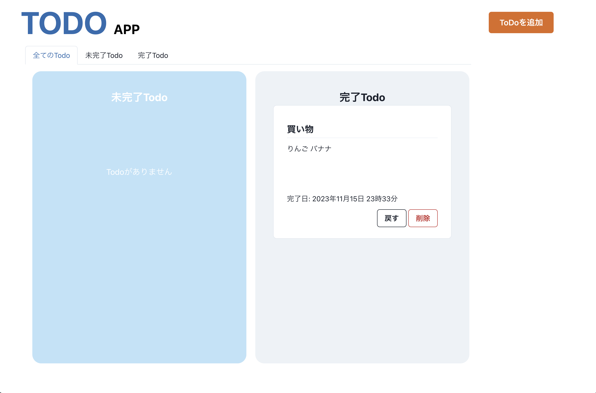

# 1.プロジェクト名：TODO APP

# 2.概要
本アプリケーションはTodoアプリケーションのフロントエンド部分を担当します。  
システム構成を下記に示します。
  

# 3.画面構成
  
##### Todoを追加ボタンを押下することでTodo追加のモーダルが展開します。  
  
##### タブを選択することで全Todo,未完了Todo,完了Todoと表示を切り替えます。例として未完了Todoの表示状態を示します。  

##### タイトルと内容には入力文字数100文字以内の制限を設定しています。  
  
##### Todoの完了ボタンを押すことで完了TodoコーナーへTodoが移動します。戻すボタンを押すと未完了Todoコーナーへ戻すことができます。

# 4.依存関係
プロジェクトの依存関係は`package.json`を参照してください。  

# 5.セットアップ手順
npmのインストールを前提とします。
```
git clone https://github.com/takeo-t/TodoApp.git //ローカルにセットアップ
cd todo_app
```
```
npm start //ローカルサーバーの立上げ
```
```
npm run build //プロジェクトをビルドする。 
```

# 6. アプリケーションのホスト先
 Microsoft Azure Static Web Appsにホストしています。  
 `https://proud-wave-053bcc300.4.azurestaticapps.net`

# 7. 環境変数の設定方法について
　ローカル開発環境では.envファイルに環境変数を設定しますが、GitHub ActionのCI/CD経由でアプリケーションをデプロイするときはGitHubのリポジトリ>Settings>Secrets and variables>Actionsでシークレット変数を設定し、.github/workflows/azure-static-web-apps-proud-wave-053bcc300.ymlファイル内でそのシークレット変数を呼び出します。
```
//.github/workflows/azure-static-web-apps-proud-wave-053bcc300.yml
env:
    REACT_APP_API_URL: ${{ secrets.REACT_APP_API_URL }}
```

# 8. 作者情報
Taiki Takeo  
E-mail takeo-t@118satellite.com  

